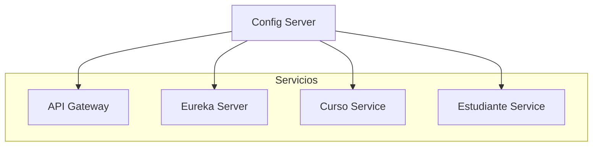

# 🧩 Microservicios con Spring Boot, Spring Cloud y Netflix Eureka

Este proyecto es una demostración de arquitectura basada en microservicios usando **Spring Boot**, **Spring Cloud Netflix Eureka**, **Spring Cloud Config** y un **API Gateway**.

Cada servicio está desarrollado y desplegado de forma independiente, permitiendo una arquitectura escalable, mantenible y orientada a servicios.

---

## 📦 Servicios Incluidos

| Servicio                   | Descripción                                                     | Puerto      |
|---------------------------|------------------------------------------------------------------|-------------|
| `microservice-eureka`     | Registro de servicios (Eureka Server)                            | `8761`      |
| `microservice-config`     | Servidor de configuración centralizada                           | `8888`      |
| `microservice-gateway`    | API Gateway para enrutar peticiones a los microservicios         | `8080`      |
| `microservice-student`    | Microservicio que gestiona estudiantes                           | `8081`      |
| `microservice-course`     | Microservicio que gestiona cursos                                | `8082`      |

---

## 🧰 Tecnologías Utilizadas

- Java 17+
- Spring Boot
- Spring Cloud Gateway
- Spring Cloud Config
- Spring Cloud Netflix Eureka
- Maven
- Spring Web
- Spring Data JPA
- H2 Database (para desarrollo)

---

## 🧩 Componentes principales por módulo

### 1. `microservice-eureka` – 📘 Eureka Server

Servidor de registro y descubrimiento de servicios.

- Usa la anotación `@EnableEurekaServer` para habilitar Eureka.
- Gestiona el registro y disponibilidad de microservicios.
- No contiene lógica de negocio ni controladores propios.
- Accesible desde: `http://localhost:8761`

---

### 2. `microservice-config` – ⚙️ Config Server

Centraliza la configuración externa de todos los microservicios.

- Anotado con `@EnableConfigServer`.
- Lee archivos `.yml` desde un repositorio Git (o local).
- Los microservicios clientes usan `bootstrap.yml` para conectarse.
- Puerto por defecto: `8888`

---

### 3. `microservice-gateway` – 🚪 API Gateway

Punto de entrada unificado para todas las peticiones.

- Redirige peticiones a los microservicios mediante rutas.
- Usa Spring Cloud Gateway y Eureka Client (`@EnableDiscoveryClient`).
- Configura filtros, rutas y balanceo de carga en `application.yml`.
- Puerto por defecto: `8080`

---

### 4. `microservice-student` – 👨‍🎓 Microservicio de Estudiantes

Maneja toda la lógica relacionada con estudiantes.

- Entidad principal: `Student`
- Repositorio JPA: `StudentRepository`
- Controlador REST: `StudentController`
- Conectado al Gateway y registrado en Eureka.
- Configuración externa manejada por el Config Server.

---

### 5. `microservice-course` – 📚 Microservicio de Cursos

Maneja la gestión de cursos académicos.

- Entidad principal: `Course`
- Repositorio JPA: `CourseRepository`
- Controlador REST: `CourseController`
- También registrado en Eureka y expuesto a través del Gateway.

---
